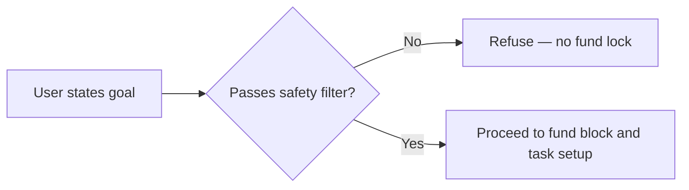
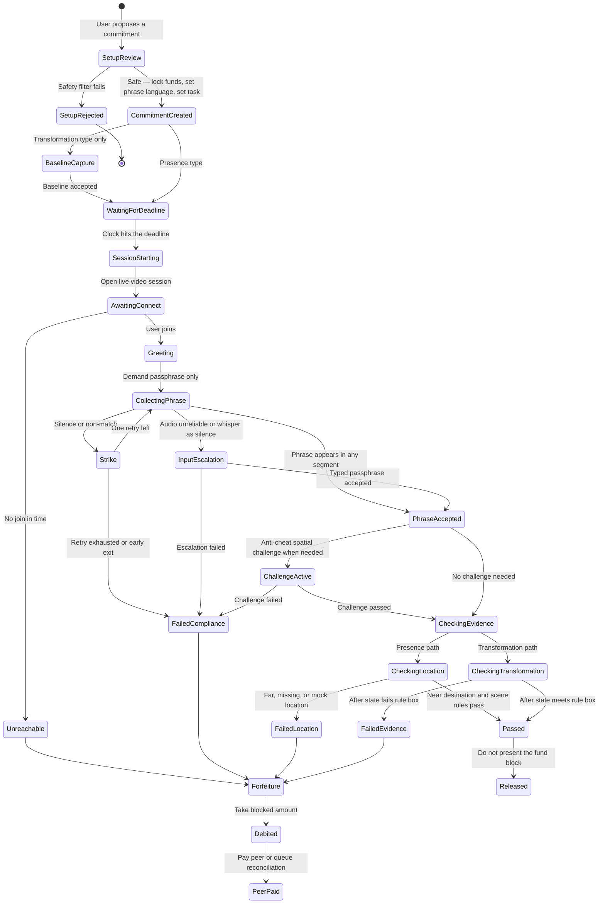
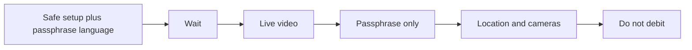
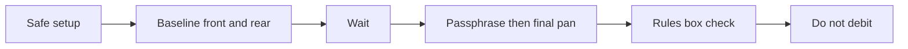
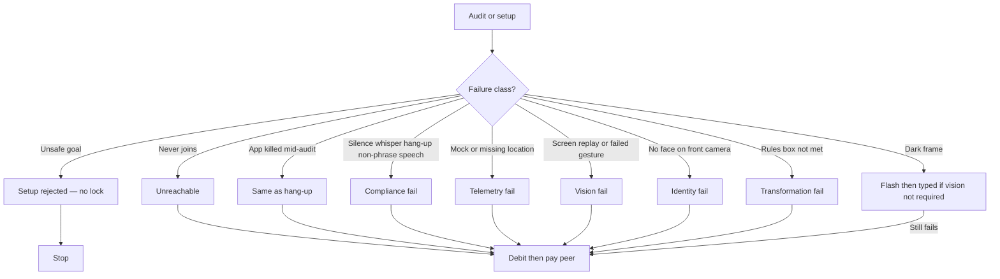

# Sancus Agent States — Happy and Unhappy Flows

**Name:** Sancus was the Roman god of trust, honesty, and oaths — the deity of business contracts and binding agreements. Breaking the deal invited financial ruin. The agent enforces that same logic.

Answer for judges: *What states does your agent go through?* Formal language. Short words. Charts over slogans.

**Interface:** An in-app live video session. A stern visual avatar speaks; subtitles show every instruction. The agent listens for the passphrase only, samples camera frames on a short timer (front and rear), and receives ordinary device location from the companion app.

**Passphrase-only speech:** At creation the user picks a language; the day’s passphrase is issued in that language. The user must speak (or type, after escalation) **only that passphrase**. There is no free conversation. Extra talk is ignored except as a failed match. Language switching mid-sentence is irrelevant: matching is binary — phrase present in a transcript segment, or not. Open dialogue is banned to close prompt-injection loopholes.

**Commitment types (chosen at creation):**

| Type | Meaning | Extra evidence |
| --- | --- | --- |
| Presence | Be at a place by a time | Live location near the destination; camera scene when needed |
| Transformation | Change a place or digital state | Baseline recording at setup; later recording compared under **judge-configured rules** |

---

## Setup filter (before any fund lock)

The agent cannot insure self-harm, illegal acts, extreme deprivation, crimes against persons or property, or risks to life.

During setup, text and (where relevant) vision parse the stated goal. If the user tries to lock a contract for starvation, extreme sleep loss, violence, theft, property damage, or similar, the state machine **refuses** the payments lock and replies: *“This commitment violates safety parameters and cannot be insured.”*



---

## States the agent moves through



---

## Happy flow (Presence)

1. **Setup** — Goal passes the safety filter. User chooses Presence, passphrase language, place, time, peer; funds are blocked.
2. **Waiting** — Until the deadline.
3. **Session** — Avatar opens live video; subtitles demand the passphrase only.
4. **Phrase** — Match if the passphrase appears in **any** recognition segment (spoken), or via typed escalation.
5. **Evidence** — Location near destination; front-camera face continuity plus rear-camera place cues when required.
6. **Pass** — Do not present the fund block.



---

## Happy flow (Transformation)

1. **Setup** — Safety filter passes; Transformation selected; passphrase language set.
2. **Baseline** — Front and rear capture; face continuity on front; room geometry and clutter anchors logged.
3. **Waiting** — User works until the deadline.
4. **Audit** — Passphrase liveness; same pan path under the **rules box**.
5. **Pass** — After-state meets the configured rules; fund block not presented.



### Transformation rules box (build stage)

Judge-configured thresholds for “change enough” live here (clutter reduction, required objects gone/present, bounds). Exact numbers are filled at build time — not hard-coded in this narrative.

```text
┌─────────────────────────────────────────────────────────┐
│  TRANSFORMATION RULES BOX (configured at build / per task) │
│  • Minimum clutter reduction inside baseline bounds: ___ │
│  • Required object classes cleared / added: ___          │
│  • Angle tolerance vs baseline geometry: ___             │
│  • Front-camera face continuity required: yes            │
│  • Rear-camera scene required: yes / task-dependent      │
└─────────────────────────────────────────────────────────┘
```

**If the model judges wrong:** The peer already holds (or is owed) the penalty. The user can send a clear photo to that friend, explain the miss, and ask for the money back — recovering funds **and** social proof. The product prefers peer-mediated correction over soft on-call empathy.

---

## Unhappy flows (from real session failure modes)

Every deviation is treated as an attempt to protect the stake. Timeouts, input pivots, or penalty — never free chat.



### Acoustic and session layer

| Break | What actually happens | Agent counter | Result |
| --- | --- | --- | --- |
| Groggy silence / whisper | Answers to stop ringing; silence or whisper treated as no speech | Silence limit → alarm → typed passphrase on screen → fail if still empty | Escalation, then fail |
| Barge-in | Talks over avatar; fragments arrive while playback runs | Mute playback on speech; ignore partials until a full segment; search that segment for the passphrase | Wait for segment; match or strike |
| Extra speech / bargaining / “prompt injection” | User says anything other than the passphrase | Not interpreted as dialogue. No empathy. Only passphrase match. Interrupt: “Excuses are non-compliant. Strike one. Say the phrase.” | One retry, then fail |
| Phrase buried in a monologue | Long talk, then the passphrase appears in a later segment | Accept if passphrase appears in **any** segment | Pass phrase step |
| Packet loss / noise | Broken words | Fuzzy match ≥ ~80%; else typed passphrase (and pan only if vision is required for this task) | Escalation |
| Hang-up or app kill | Leaves or OS kills the app before verified | Same as disconnect — risk is unrecoverable for this audit → forfeit | Execute penalty |

### Vision and anti-cheat layer

| Break | What actually happens | Agent counter | Result |
| --- | --- | --- | --- |
| Dark room / covered lens | Black frames | Enable flash (payment-app style). If still unusable **and** this check does not depend on visual confirmation → typed-only path. If vision is required → fail | Typed-only or fail |
| Screen replay | Camera aimed at a playback screen | Spatial challenge (feet, pan, random fingers); parallax + gesture + display-artifact checks | Challenge; fail if ignored |
| Wrong person / no face | Roommate or empty front camera | Audit uses **front and rear** cameras. Front portion requires face continuity with the enrolled user | Fail identity |
| Clutter shuffle | Trash out of frame or angle fake | Rules box: clutter reduction inside baseline bounds; angle-only change fails | Fail evidence |

### Location and client telemetry

| Break | What actually happens | Agent counter | Result |
| --- | --- | --- | --- |
| Parking-lot cheat | Near the place but not in the facility | Proximity necessary but not enough when scene is required; rear camera must show place cues | Fail unless scene confirms |
| Permission off / mock / airplane | No clean coordinates in time | Reject mock providers; timeout → fail telemetry | Fail telemetry |

### Payments and settlement

| Break | What actually happens | Agent counter | Result |
| --- | --- | --- | --- |
| Empty account night before | Hope debit bounces | Amount already blocked at scheduling | Bounce blocked by design |
| Peer payout fails after debit | Merchant debit ok; peer transfer fails | Enforcement complete on debit; payout retries from queue | Reconciliation queued |
| Pass but no public void API | User passed; release schema missing | `AUDIT_PASSED` + **do not present**; expire unpresented if needed | Pass without capture |

---

## Unhappy-flow transition matrix

| Step | Encountered failure | Detection | Agent action | Resulting state |
| --- | --- | --- | --- | --- |
| Setup | Self-harm, crime, deprivation, life/property harm | Safety filter on goal text (and vision if needed) | Refuse fund lock | Setup rejected |
| Audit start | No join / declined | Session status | No grace | Execute penalty |
| Session | App killed mid-audit | Client disconnect | Same as hang-up | Execute penalty |
| Acoustic | Silence / whisper | Silence timeouts | Alarm → typed passphrase | Input escalation |
| Acoustic | Non-passphrase speech | Transcript ≠ phrase | Strike one | Single retry |
| Acoustic | Hang-up before verified | Disconnect | Forfeit on disconnect | Execute penalty |
| Vision | Darkness | Black frames | Flash; typed-only if vision not required | Escalation or fail |
| Vision | Screen replay | Parallax / gesture / artifacts | Spatial challenge | Challenge active |
| Vision | No face continuity (front) | Front-camera identity | Fail | Execute penalty |
| Telemetry | Revoked or mock location | Client integrity | Reject; short timeout | Fail telemetry |
| Presence | Near place, wrong scene | Location + rear camera | Require place cues | Execute penalty if missing |
| Transformation | Rules box miss | Geometry + clutter delta | Fail evidence | Execute penalty |
| Settlement | Peer bank down | Payout error | Retry queue | Reconciliation queued |

---

## One-line judge summary

**Create (safety filter + passphrase language) → optional baseline → wait → connect → passphrase only → place or change evidence → pass or forfeit.** No chat. No prompt-injection surface. Happy paths never present the block. Unresolved live failure moves money toward the peer; a bad vision call can still be socially reversed peer-to-peer with a photo.
